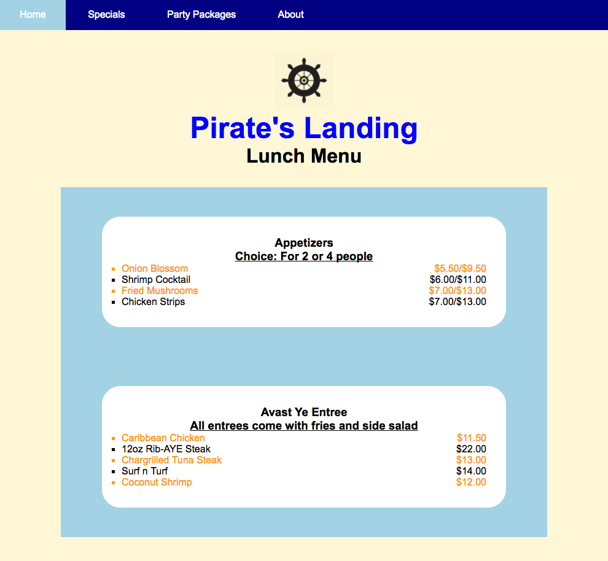

# Homework : Advanced and Pseudo Selectors

## Setup

Make sure that you are on the `master` branch of your `wdi-remote-...` repo.
Then run `git pull upstream master` to pull the latest materials from the
instructors' repository. You shouldn't hit a merge conflict here, but if you do,
flag down an instructor right away.

#### Exercise Objectives

- gain more experience using CSS skills to build a complete layout
- get more practice styling with advanced and pseudo CSS selectors to keep HTML "DRY"
- gain more experience styling a container and child div
- gain meaningful repetitions using `inline-block` to lay out a list of elements in a row

#### Directions

1.  In `style.css` use CSS selectors, including advanced and/or pseudo selectors, and CSS properties to recreate the layout seen below. You will *not* be modifying any of the HTML in `index.html`, as it is provided already. The logo image is provided for you in the `images` directory.
  - The `<nav>` should be made into a nav bar that spans the entire width of the page, a height of 50px, white font, and the `<li>` links spaced out without the bullet points
  - Hovering over the `<nav>` links' should turn the links' background lightblue.
  - The logo should be 100px wide and centered in the page
  - The first `<h1>` should be blue and font-size larger than a normal h1 tag
  - The 2 menus' outer divs should be lightblue, the inner should be white
  - All headings should be centered
  - The bottom `<h3>` in the menus should be underlined
  - The `` prices should be on the right side
  - The menu `<li>` should have square bullets
  - Every odd number `<li>` in the menu should be colored orange

#### Layout

#### Reach Goals - More Advanced Selectors!

- Using only CSS:
  - Change the last `li` in the `nav` bar to capital letters
  - The text should turn green when you hover all even-numbered `li` in the menu
  - All visited links should be colored pink
  - Remove the last div's background color, and use a border of your choice instead
  - Bold every 3rd `span` tag

## Submitting Your Work

  When you're ready to submit your work,

  1.  Add, commit, and push your code to your fork of the class repo.
  2.  File an issue on the class repo titled "Your Name -- wXXdXX".

  The issue should include:

  -   A link that points back to your fork.

  -   A 'comfort' score on how you feel about the material, from 1 (very
      uncomfortable) to 5 (very comfortable)
